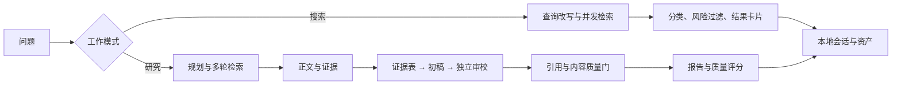
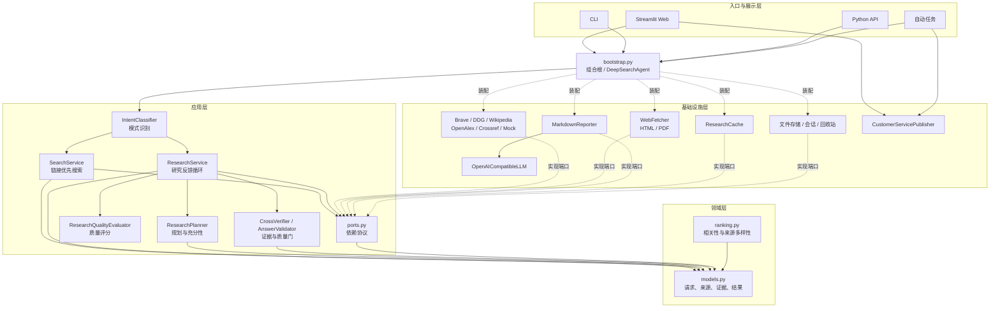
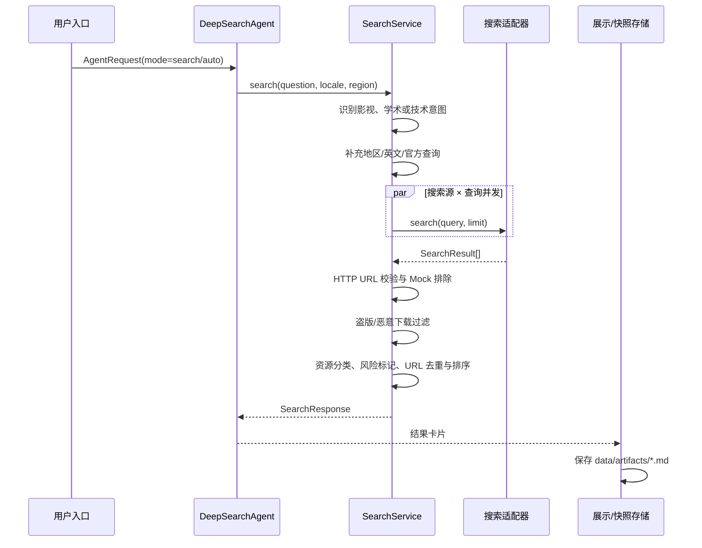
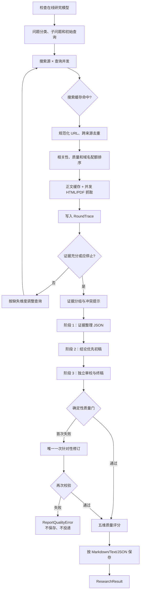
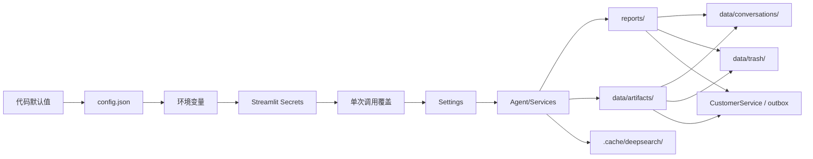

# DeepSearch

> 当前版本：2.2.0 · Python 3.11+ · Streamlit 1.62+ · 本地优先

DeepSearch 是一个面向个人使用的 AI 搜索与研究助手。它把“找入口”和“做研究”明确分开：搜索模式返回可直接访问的链接与资源卡片；研究模式执行多轮检索、正文读取、证据整理、报告生成和质量校验。会话、搜索快照、报告、任务和配置默认都保存在本机。

## 阅读导航

- [核心能力](#核心能力)
- [快速开始](#快速开始)
- [工作模式](#工作模式)
- [在线配置](#在线配置)
- [Web 工作台](#web-工作台)
- [CLI 常用命令](#cli-常用命令)
- [项目架构](#项目架构)
- [本地数据](#本地数据)
- [验证与已知边界](#验证)

## 核心能力

- **三种工作模式**：智能判断、搜索、研究；显式选择始终优先。
- **链接优先搜索**：并发查询多个来源，去重、分类并标注访问风险，不强行生成论文式报告。
- **迭代式研究**：根据证据充分性决定停止或补搜，不固定机械执行若干轮。
- **结论优先报告**：同一模型依次完成证据整理、初稿和独立审校，随后再过确定性质量门。
- **真实失败语义**：在线失败不会混入 Mock；缺少模型时研究在检索前停止；模型错误会给出可操作提示。
- **个人工作台**：本地会话、快捷输入、资料库、项目回收站、自动任务和 CustomerService 投递。
- **安全持久化**：密钥不写入 `config.json`；会话不保存完整网页正文；不合格报告不落盘。



## 快速开始

Windows PowerShell：

```powershell
cd D:\code\pycharm\DeepSearch
python -m venv .venv
.\.venv\Scripts\Activate.ps1
python -m pip install -e ".[dev]"
Copy-Item config.example.json config.json
deepsearch web
```

浏览器默认打开 `http://localhost:8501`。只安装 Web 运行依赖时可使用 `python -m pip install -e ".[ui]"`。

无需网络和密钥的界面/流程演示：

```powershell
deepsearch --mock web
deepsearch --mock ask "Python 3.13 有哪些新特性"
```

Mock 只验证流程，会在界面和报告中明确标识，不计入真实来源、多源验证或质量评分。

## 工作模式

| 模式 | 适合场景 | 处理方式 | 是否需要模型 |
|---|---|---|---|
| 智能判断 | 不想手动选择 | 资源、链接、官网等倾向搜索；论文、比较、调研、报告等倾向研究；歧义时走搜索 | 取决于路由结果 |
| 搜索 | 找官网、文档、影视平台、网页或论文入口 | 查询补充、并发检索、去重、分类、风险过滤，输出结果卡片 | 否 |
| 研究 | 比较、综述、方案评估、深度调研 | 多轮检索、正文读取、证据综合、三阶段写作、质量门和评分 | 在线模式需要 |

CLI 的 `ask` 为兼容旧版默认使用研究模式，建议显式传入模式：

```powershell
deepsearch ask "找一下怪奇物语的正规播放平台" --mode search
deepsearch ask "找 RAG 论文并比较长上下文方案" --mode auto
deepsearch ask "调研 Agent 架构并给出选型结论" --mode research
```

## 在线配置

在线搜索默认尝试 Brave（已配置时）、DuckDuckGo 和 Wikipedia；学术请求还会加入 OpenAlex 与 Crossref。普通搜索不需要大模型密钥。在线研究使用 OpenAI Chat Completions 兼容接口：

```powershell
$env:DEEPSEARCH_BRAVE_API_KEY = "your-brave-key"
$env:DEEPSEARCH_API_KEY = "your-model-key"
$env:DEEPSEARCH_BASE_URL = "https://api.openai.com/v1"
$env:DEEPSEARCH_MODEL = "gpt-4o-mini"
$env:DEEPSEARCH_LLM_TIMEOUT = "180"
deepsearch web
```

也可以把同名键写入未被 Git 跟踪的 `.streamlit/secrets.toml`，模板见 `.streamlit/secrets.toml.example`。模型超时独立于网页抓取超时；思考模型或长报告可在“设置 → 研究模型”中适当提高，允许范围为 30–900 秒。

常用环境变量：

| 变量 | 用途 | 默认/说明 |
|---|---|---|
| `DEEPSEARCH_RUNTIME_MODE` | `online` 或 `mock` | 默认 `online` |
| `DEEPSEARCH_BRAVE_API_KEY` | 启用 Brave Search | 可选 |
| `DEEPSEARCH_API_KEY` | 在线研究模型密钥 | 研究必需 |
| `DEEPSEARCH_BASE_URL` | OpenAI 兼容接口根地址 | `https://api.openai.com/v1` |
| `DEEPSEARCH_MODEL` | 服务端模型 ID | `gpt-4o-mini` |
| `DEEPSEARCH_LLM_TIMEOUT` | 单次模型调用超时（秒） | `180`，最小 `10` |
| `DEEPSEARCH_CONFIG` | 自定义配置文件路径 | `./config.json` |
| `DEEPSEARCH_CUSTOMER_SERVICE_ENABLED` | 启用知识库联动 | 默认关闭 |
| `DEEPSEARCH_CUSTOMER_SERVICE_INTEGRATION_KEY` | 联动身份凭据 | 启用联动时必需 |
| `DEEPSEARCH_CUSTOMER_SERVICE_API_KEY` | 可选的 API Bearer 凭据 | 可选 |

完整普通配置见 `config.example.json`。加载优先级为：内置默认值 → JSON → 环境变量/Streamlit Secrets → 调用参数。保存设置时所有密钥字段都会被清空。

## Web 工作台

侧栏包含“对话、全部记录、资料库、回收站、自动任务、设置”。首页支持：

1. 选择工作模式并输入问题；高级选项可设置研究强度、领域、信息类型、时间范围、地区、篇幅、读者和章节。
2. 用快捷输入预填常用问题；点击后不会立即执行，可继续编辑再发送。
3. 查看搜索卡片或结论优先研究报告，以及折叠的证据、审校和质量信息。
4. 下载、复制、继续追问、切换模式重跑，或把已落盘资产推送到 CustomerService。
5. 在资料库下载或推送选中资产，也可把资产移到项目回收站；恢复时不会覆盖同名文件，永久删除需要再次确认。
6. 使用输入栏上方的悬浮按钮平滑回到页面顶部或直接到达对话底部。

删除资料库资产后，报告选择器会根据现有文件集合立即重建，不再保留已删除项；删除会话只删除聊天 JSON，不会连带删除报告或搜索快照。

### CustomerService 联动

DeepSearch 对接 CustomerService v2 异步入库接口。两边必须使用同一个联动密钥，并且这里填写的是 API 根地址（默认 `http://127.0.0.1:8000`），不是 CustomerService 的 Streamlit 页面端口。

```toml
# DeepSearch: .streamlit/secrets.toml
DEEPSEARCH_CUSTOMER_SERVICE_INTEGRATION_KEY = "与接收端一致的密钥"
```

```dotenv
# CustomerService: .env
DEEPSEARCH_INTEGRATION_KEY=与发送端一致的密钥
```

推送流程为 `POST /api/v2/integrations/deepsearch/documents` → 返回 `202 + job_id` → 查询 external ID 的版本状态。只有状态成为 `succeeded` 且返回 `document_id` 时页面才显示“已写入知识库”；连接、鉴权、后台入库或等待超时会显示具体原因，并把不含正文和密钥的记录留在 outbox。CustomerService 演示模式不接收 `confidential` 文档。

## CLI 常用命令

```powershell
deepsearch ask "问题" --mode search
deepsearch interactive
deepsearch history --query "RAG"

deepsearch tasks list
deepsearch tasks add "AI 日报" "总结最近一天 AI Agent 领域的重要变化" --time 10:00
deepsearch tasks run "AI 日报"
deepsearch schedule --once

deepsearch delivery list
deepsearch delivery retry --force
```

自动任务是本地前台轻量调度器，进程退出后不会继续运行。任务执行研究流程，因此在线模式同样需要模型。

## 项目架构

### 架构目标

项目没有把所有逻辑堆在 Streamlit 页面或一个 Agent 类中，而是围绕以下目标分层：

- **搜索与研究解耦**：搜索返回链接，研究生成报告，两者共享来源模型但不共享错误的输出模板。
- **业务与技术解耦**：研究循环只依赖抽象端口，不直接依赖 DuckDuckGo、磁盘或具体模型服务。
- **入口行为一致**：Web、CLI、Python API 和自动任务最终都调用 `DeepSearchAgent`。
- **在线与 Mock 隔离**：Mock 只能显式启用，不作为在线失败时的隐藏降级。
- **先校验后保存**：模型输出不是最终结果，只有通过确定性质量门的研究报告才会落盘。
- **本地数据有边界**：配置、会话、报告、缓存、回收站和投递队列职责分开，密钥不进入普通持久化数据。

### 分层依赖



依赖方向从外向内：展示层调用公共门面，应用层操作领域对象，基础设施实现应用层声明的能力。`bootstrap.py` 是例外的组合根，负责同时认识应用和基础设施并完成依赖注入。

### 各层职责

| 层 | 主要文件 | 负责 | 不负责 |
|---|---|---|---|
| 领域层 | `domain/models.py`、`domain/ranking.py` | 请求、计划、来源、证据、轨迹、评分和结果模型；稳定来源排序 | HTTP、文件、Streamlit、模型调用 |
| 应用层 | `application/*.py` | 路由、搜索编排、研究循环、停止条件、证据验证和评分 | 创建具体搜索源、读取配置、绘制页面 |
| 基础设施层 | `infrastructure/*.py` | 搜索 API、HTML/PDF 抓取、模型客户端、报告器、缓存、文件存储和投递 | 决定页面交互或复制研究主循环 |
| 展示层 | `presentation/`、`streamlit_app.py`、`app_pages/` | 参数/表单转换、进度展示、会话恢复、结果渲染 | 自己实现搜索、引用验证或存储规则 |
| 调度层 | `scheduling/topics.py` | daily/weekly/once 到期判断、成功幂等、任务执行 | 后台守护、分布式队列 |
| 组合根 | `bootstrap.py` | 按设置创建适配器，暴露 `DeepSearchAgent` | 承载具体页面或研究算法 |

### 目录与模块

```text
DeepSearch/
├─ streamlit_app.py                      # Web 入口、页面注册、侧栏与全局状态
├─ app_pages/
│  ├─ home.py                            # 统一对话、搜索/研究结果和结果操作
│  ├─ conversations.py                   # 全部会话、搜索、分页与删除
│  ├─ history.py                         # 搜索快照和研究报告资料库
│  ├─ trash.py                           # 恢复与永久删除
│  ├─ tasks.py                           # 自动研究任务管理
│  └─ settings.py                        # 搜索、模型、联动和本地数据设置
├─ deepsearch/
│  ├─ bootstrap.py                       # 组合根与公共 Agent 门面
│  ├─ domain/
│  │  ├─ models.py                       # 跨层领域对象
│  │  └─ ranking.py                      # 来源相关性、质量与域名配额
│  ├─ application/
│  │  ├─ intent.py                       # AUTO 模式路由
│  │  ├─ search_service.py               # 单轮链接搜索用例
│  │  ├─ service.py                      # 多轮研究主循环
│  │  ├─ planner.py                      # 问题拆解、充分性和查询调整
│  │  ├─ verification.py                 # 证据分组与确定性质量门
│  │  ├─ evaluation.py                   # 五维研究评分
│  │  ├─ prompts.py                      # 三阶段集中式 Prompt
│  │  ├─ ports.py                        # 应用层依赖协议
│  │  └─ errors.py                       # 可展示的业务错误
│  ├─ infrastructure/
│  │  ├─ search/                         # 六类在线/Mock 搜索适配器
│  │  ├─ fetcher.py                      # 并发 HTML/PDF 正文读取
│  │  ├─ llm.py                          # OpenAI Chat Completions 兼容客户端
│  │  ├─ reporting.py                    # 三阶段报告与 Mock 模板
│  │  ├─ cache.py                        # 搜索/正文两级 JSON 缓存
│  │  ├─ storage.py                      # 报告、快照、会话、快捷输入、回收站
│  │  ├─ config.py                       # 配置合并、迁移和安全保存
│  │  └─ customer_service.py             # 幂等投递与 outbox
│  ├─ presentation/
│  │  ├─ cli.py                          # CLI 子命令和日志
│  │  └─ web/
│  │     ├─ support.py                   # 会话适配、后台进度与展示数据
│  │     ├─ delivery.py                  # Web 手动投递身份与资料库资产转换
│  │     ├─ styles.py                    # 原生页面公共样式
│  │     └─ scroll_controls.py           # CCv2 回顶/到底悬浮控件
│  └─ scheduling/topics.py               # 自动任务模型、管理器和调度器
├─ tests/                                # 69 项离线优先测试
├─ docs/                                 # 用户、架构与维护文档
├─ config.example.json                   # 完整普通配置模板
└─ pyproject.toml                        # 包、依赖和命令入口
```

### 统一入口和路由

所有交互入口最终构造 `AgentRequest`：

```python
AgentRequest(
    question="找 Python 官方文档",
    mode=WorkMode.AUTO,
    brief=ResearchBrief(...),
    locale="zh-CN",
    region="CN",
)
```

`DeepSearchAgent.run()` 的职责只有三步：

1. 规范化用户请求的 `WorkMode`。
2. `AUTO` 时交给 `IntentClassifier`，显式模式直接采用。
3. 将请求分派给 `SearchService` 或 `ResearchService`，返回互斥的 `AgentRunResult`。

```text
AgentRequest
     │
     ▼
IntentClassifier（仅 AUTO）
     │
     ├─ SEARCH   → SearchResponse
     │
     └─ RESEARCH → ResearchResult
                        ├─ report
                        ├─ sources
                        ├─ trace
                        ├─ metrics
                        ├─ scorecard
                        └─ report_path
```

### 搜索模式执行链路



搜索模式只处理搜索摘要，不抓取全文，也不调用大模型。影视查询优先显示正规播放平台；学术查询追加 OpenAlex 与 Crossref。全部在线来源失败时抛出 `SearchUnavailableError`，绝不自动生成 Mock 链接。

### 研究模式执行链路



研究循环不是固定搜三轮。`ResearchPlanner` 每轮根据证据决定：

- 简单事实获得一个可用来源后可停止；
- 比较、研究和开放探索默认至少完成两轮；
- 每个子问题是否拥有足够支持；
- 来源域是否过于集中；
- 是否连续两轮没有新增来源；
- 是否达到最大轮次或来源预算。

下一轮查询围绕 `missing_dimensions` 生成，而不是重复原问题。每轮查询、结果数、新来源、正文数、耗时、判断、缺口和下一轮查询都会写入 `RoundTrace`。

### 三阶段报告与质量门

三阶段使用同一个 `OpenAICompatibleLLM`，通过三套集中 Prompt 分工：

| 阶段 | 输入 | 输出 | 目的 |
|---|---|---|---|
| 证据整理 | 问题、目标、子问题、来源正文/摘要 | 直接答案、claims、引用、冲突、缺口 JSON | 先把资料变成可写作的证据结构 |
| 初稿生成 | 证据表、读者、篇幅、章节和自定义要求 | 结论优先 Markdown | 避免只有摘要和引用，没有明确结论 |
| 独立审校 | 初稿、证据表、原始来源上下文 | issues + 重写终稿 JSON | 消除重复、空话和无依据扩写 |

终稿还要经过 `AnswerValidator`：

- 引用编号必须存在；
- 必须包含结论和参考来源结构；比较、探索与深度研究还必须包含分析；
- 计划中的子问题要得到覆盖；
- 详细论点与被引来源至少存在最低词项支持；
- 不得有大段重复或网页导航模板噪声。

来源清单由系统从本次 `Source` 集合确定性补齐，不依赖模型生成。校验首次失败可触发一次定向修订，第二次仍失败就终止。`ResearchQualityEvaluator` 只对通过质量门的结果计算引用完整性、问题覆盖、来源多样性、来源质量和检索健康度。

Web 把阻塞研究放入有限后台线程池，页面线程按整秒更新默认折叠的紧凑状态条。展开后的“思考步骤与说明”展示高层阶段、最新说明和每步用时，不包含模型隐性思维链；任务结束会立即移除“停止生成”按钮。首页另用隔离样式的 CCv2 小组件提供回顶/到底操作，动态识别实际滚动容器，只在鼠标滚轮活动时淡入，空闲后淡出；滚动动画可被第一下反向滚轮立即取消。最终报告不会进行 token 级流式展示，因为它必须先完成三阶段写作和质量门，校验通过后才一次性渲染。

### 核心领域对象

| 对象 | 作用 | 主要生产者/消费者 |
|---|---|---|
| `AgentRequest` | 统一请求，包含模式、地区和研究规格 | Web/CLI → `DeepSearchAgent` |
| `SearchPlan` | 问题类型、子问题、查询和最低轮次 | `ResearchPlanner` → `ResearchService` |
| `SearchResult` | 尚未读取正文的搜索候选 | 搜索适配器 → 搜索/研究用例 |
| `Source` | 带正文或摘要、抓取状态和评分的来源 | `WebFetcher` → 验证/报告器 |
| `EvidenceGroup` | 主张、来源编号和保守可信度 | `CrossVerifier` → 报告器 |
| `RoundTrace` | 单轮查询、结果、缺口和停止判断 | `ResearchService` → Web/测试 |
| `ValidationResult` | 确定性质量门结果及问题列表 | `AnswerValidator` → 修订/保存决策 |
| `ResearchScorecard` | 五维质量解释和建议 | 评分器 → Web/报告元数据 |
| `SearchResponse` | 搜索答案、卡片、警告和快照路径 | 搜索用例 → 展示层 |
| `ResearchResult` | 报告、来源、轨迹、指标、评分和文件路径 | 研究用例 → 展示/调度/投递 |
| `AgentRunResult` | 搜索或研究二选一的统一外壳 | Agent → 所有入口 |

### 基础设施装配

`bootstrap.py` 根据 `Settings` 组装实际运行对象：

```text
Settings
  ├─ build_search_providers()
  │    ├─ BraveSearch（有 Key 才启用）
  │    ├─ DuckDuckGoSearch
  │    └─ WikipediaSearch
  ├─ 学术源：OpenAlexSearch + CrossrefSearch
  ├─ WebFetcher
  ├─ ResearchCache
  ├─ SourceRanker
  ├─ MarkdownReporter(OpenAICompatibleLLM | None)
  ├─ FileReportStorage
  ├─ SearchService
  └─ ResearchService
```

显式 Mock 模式使用 `MockSearch` 和确定性报告模板；在线模式没有模型 Key 时仍允许搜索，但 `research()` 会在任何网络检索前抛出 `ResearchModelRequiredError`。

### 配置、状态和数据流



普通配置的基础优先级是默认值 → JSON → 环境变量 → 调用覆盖；Web 还会从 Streamlit Secrets 安全注入模型、Brave 和联动凭据。`save_settings()` 会强制清空密钥字段。

会话只保存消息、模式、轻量来源元数据、资产路径和投递状态，不保存完整网页正文。资料库删除会把资产移到 `data/trash/`，清除会话中的失效路径；恢复和永久删除都会重新校验允许目录和元数据。

### 可靠性与失败语义

| 场景 | 系统行为 |
|---|---|
| 单个搜索源异常 | 隔离异常，继续等待其他来源 |
| 单个网页 403/521/超时 | 保留摘要和错误状态，研究继续 |
| 所有在线搜索为空 | 明确失败，不降级 Mock |
| 在线研究没有模型 Key | 检索前失败，避免无意义网络开销 |
| 模型 400/401/403/404 | 不重试，返回配置/权限提示 |
| 模型限流、5xx、网络或超时 | 最多重试一次 |
| 模型三阶段失败 | 保留失败阶段并终止，不生成伪报告 |
| 质量门两次不通过 | 不保存、不投递 |
| 并发任务乱序完成 | 按任务创建顺序重组，再稳定排序 |
| 缓存损坏或过期 | 当作 miss，不阻断主流程 |
| 投递失败或 v2 入库超时 | 显示具体原因并写入不含正文的 outbox，不重复研究 |
| 回收站恢复同名冲突 | 拒绝覆盖，保留回收站条目 |

### 扩展方式

| 要扩展的能力 | 最小改动 |
|---|---|
| 新搜索源 | 实现 `SearchProvider`，在 `bootstrap.py` 注册 |
| 新正文读取方式 | 实现 `SourceFetcher` |
| 新路由策略 | 替换或扩展 `IntentClassifier` |
| 新研究规划 | 实现 `Planner`，继续产出 `SearchPlan/SufficiencyDecision` |
| 新报告格式 | 扩展存储序列化，仍先校验规范 Markdown |
| 新模型服务 | 保持 Chat Completions 兼容，或实现新的 `LanguageModel` |
| 新质量规则 | 扩展 `AnswerValidator` 或实现 `QualityEvaluatorPort` |
| 新资产存储 | 实现 `ReportStorage`，不把存储逻辑放进页面 |
| 新投递目标 | 复用 `DeliveryArtifact` 增加 publisher |
| 后台可恢复任务 | 外接状态机/队列，保留 Agent、轨迹和质量门 |

更深入的约束、时序和维护不变量见 [架构说明](docs/ARCHITECTURE.md)。

### 公共 Python 接口

```python
from deepsearch import AgentRequest, DeepSearchAgent, WorkMode
from deepsearch.infrastructure.config import load_settings

agent = DeepSearchAgent(load_settings())
run = agent.run(AgentRequest("找 Python 官方文档", mode=WorkMode.AUTO))
print(run.content)
```

## 本地数据

| 路径 | 内容 | 关键边界 |
|---|---|---|
| `data/conversations/` | 会话 JSON | 不保存密钥或完整网页正文 |
| `data/prompt-shortcuts.json` | 可编辑快捷输入 | 最多 20 条 |
| `data/artifacts/` | 搜索结果 Markdown 快照 | 可下载和投递 |
| `reports/` | 通过质量门的研究报告 | 支持 Markdown/Text/JSON |
| `data/trash/` | 回收站资产和恢复元数据 | 只允许操作项目资料库内资产 |
| `.cache/deepsearch/` | 搜索与正文缓存 | 默认 TTL 6 小时 |
| `.cache/customer-service-outbox/` | 失败投递记录 | 只存路径、哈希和非敏感元数据 |
| `logs/deepsearch.log` | 轮转日志 | 默认最多 3 个备份 |

`reports/` 下的研究产物不属于手写项目文档，本次文档整理不会改写或删除它们。

## 验证

```powershell
.\.venv\Scripts\python.exe -m pytest -q -p no:cacheprovider
```

当前收集 69 项离线优先测试，覆盖路由、搜索安全、抓取、PDF、缓存、研究循环、三阶段模型调用、模型错误、质量门、会话/快捷输入、资料库/回收站、v2 异步投递、调度和 Streamlit 页面合同。

## 已知边界

- 面向单机个人使用，不包含账号、多租户、云同步或分布式任务队列。
- 不绕过登录、付费墙、加密 PDF 或站点访问控制；JavaScript-only 页面和扫描 PDF 可能只有摘要。
- 风险标签与质量分是工程提示，不是第三方内容的真实性认证。
- 引用校验基于结构和词项支持，可拦截明显问题，但不能证明语义蕴含、时效或统计口径。
- 停止按钮是当前 Streamlit 会话的协作式中断，不是可持久恢复的后台任务取消机制。

## 文档

- [文档索引](docs/README.md)
- [用户手册](docs/USER_GUIDE.md)
- [架构说明](docs/ARCHITECTURE.md)
- [开发与维护](docs/DEV_NOTES.md)
