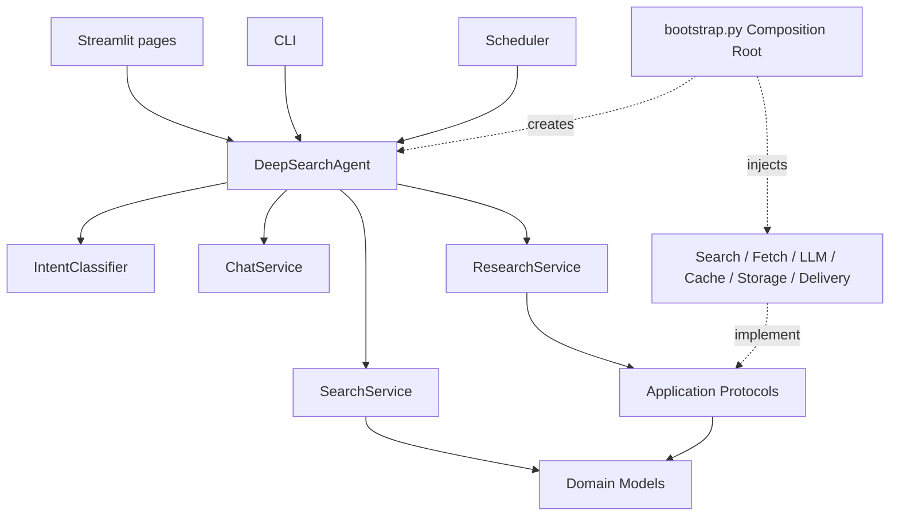
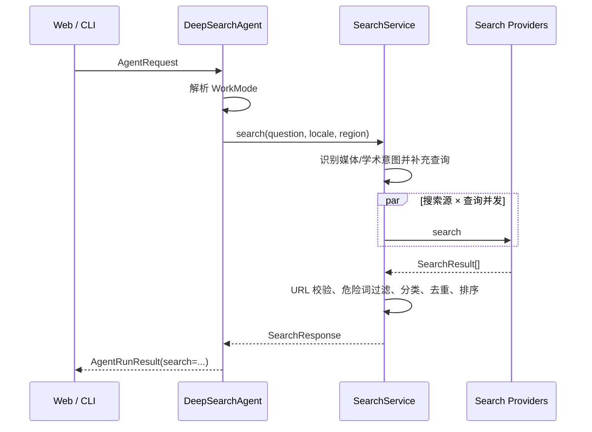
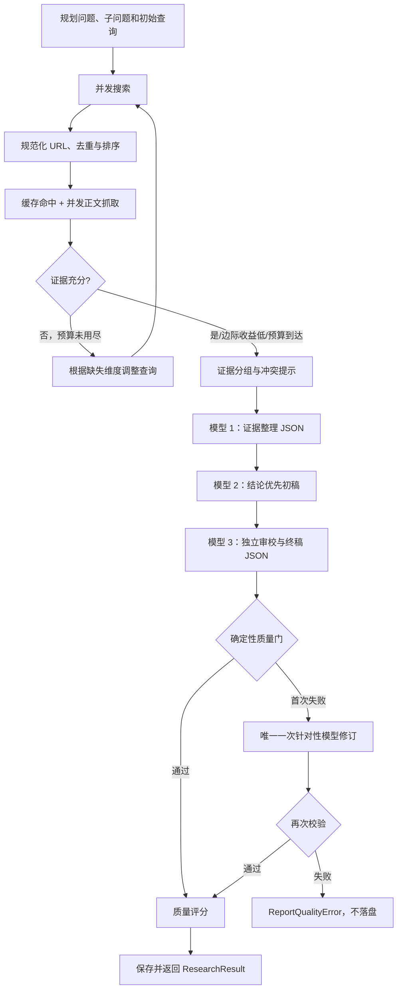

# DeepSearch 2.2 架构说明

> 当前实现基线 · 最后校准：2026-09-10

## 1. 系统定位与边界

DeepSearch 是单机、单用户、本地优先的 AI 问答、搜索与研究助手。核心目标是以统一请求支持三种互斥交付：智能匹配的直接回答、链接优先的搜索结果，以及经过证据综合和质量门的研究报告。

系统有两个正交维度：

| 维度 | 取值 | 决定什么 |
|---|---|---|
| 运行数据模式 | `runtime_mode=online/mock` | 使用真实在线来源还是显式演示数据 |
| 请求工作模式 | 用户可选 `AUTO/SEARCH/RESEARCH`；`CHAT` 为内部结果 | 本次返回直接回答、搜索卡片还是研究报告 |

`AUTO` 不是离线/在线开关。旧 `mode=auto/mock` 只作为配置兼容入口，在加载时映射到 `runtime_mode`。

明确不在当前范围内：账号、多租户、云同步、分布式任务、浏览器渲染、付费墙绕过、扫描 PDF OCR、向量知识库和生产级事实证明。

## 2. 分层和依赖方向



依赖规则：

- `domain`：跨层数据结构与稳定排序，不依赖 Streamlit、HTTP 或磁盘。
- `application`：工作模式识别、直接回答/搜索用例、研究反馈循环、验证和评分；只面向领域模型与 Protocol。
- `infrastructure`：搜索 API、网页抓取、模型客户端、报告器、缓存、文件存储和 CustomerService 投递。
- `presentation`：CLI 与 Streamlit 适配；把用户输入转换为 `AgentRequest`，把结果转换为界面或终端输出。
- `scheduling`：自动任务模型、到期判断和执行状态；继续调用统一 Agent。
- `bootstrap.py`：唯一组合根，集中实例化和注入具体适配器。

页面不会重写研究业务，应用层也不会直接创建具体搜索源或文件存储。

## 3. 入口与核心对象

### 3.1 外部入口

| 入口 | 文件 | 职责 |
|---|---|---|
| Web | `streamlit_app.py` | 页面注册、主题、幂等 Session State 初始化和侧栏 |
| Web 页面 | `app_pages/*.py` | 输入、展示和用户操作 |
| CLI | `deepsearch/presentation/cli.py` | 参数解析、退出码、前台调度和日志 |
| Python API | `deepsearch/bootstrap.py` | `DeepSearchAgent` 稳定公共门面 |

### 3.2 统一调用

```python
DeepSearchAgent.run(AgentRequest) -> AgentRunResult
```

- `AgentRequest`：问题、请求模式、`ResearchBrief`、语言/地区、会话 ID 和最多少量 `ChatTurn`。
- `AgentRunResult`：只包含 `ChatResult`、`SearchResponse` 或 `ResearchResult` 中的一种。
- `ResearchBrief`：领域、目标、信息类型、时间范围和 `ReportSpecification`。
- `ReportSpecification`：输出格式、篇幅、读者、语言、章节和额外要求。

`research()` 和 `follow_up()` 是研究专用兼容入口。CLI `ask` 默认研究是历史兼容行为，Web 默认由 `default_work_mode` 控制。

### 3.3 Web 长任务状态

Streamlit 页面不在主脚本线程中直接执行阻塞研究。页面先构造完整 `AgentRequest` 和 Agent，再把纯 Python 调用提交给共享的有限 `ThreadPoolExecutor`；后台线程只能向线程安全的 `RunProgressTracker` 写入应用层 phase/message，不能访问 Session State 或调用 `st.*`。

页面线程对齐单调时钟的整数秒轮询 tracker，同时允许阶段事件提前唤醒。原生紧凑 `st.status` 的外层标题在运行中保持稳定，只更新内部占位符中的阶段、说明和用时，因此用户手动展开后不会被增量更新收起。任务结束后页面线程负责持久化、结果渲染和清除停止按钮。

页面滚动是唯一需要浏览器能力的交互，隔离在 `presentation/web/scroll_controls.py` 的内联 CCv2 组件。组件挂载于耗时研究之前，以 Shadow DOM 和主题变量绘制回顶/到底按钮，从受信任候选中动态定位实际滚动节点；按钮只在主内容区滚轮活动时按可用方向短暂淡入，空闲后淡出。点击滚动由可随滚轮取消的帧动画完成，不传递业务数据、不阻止默认滚轮，也不触发应用 rerun；其余页面行为继续优先使用原生 Streamlit API。

## 4. 路由、直接回答与搜索流程

`IntentClassifier` 在 `AUTO` 和旧兼容值 `CHAT` 时运行。时间、计算、翻译、普通常识、问候和功能帮助进入直接回答；官网、链接、价格、天气、新闻和网页实时状态进入搜索；调研、综述、报告、方案和多来源论证进入研究。只有用户显式选择的搜索或研究会强制覆盖智能判断；没有检索或研究信号时默认直接回答。

### 4.1 快速回答隔离

`ChatService` 位于应用层，先用本地时钟和受限算术求值处理确定性请求，再按需使用可选的 `ChatModel`。组合根仅在 `chat_llm` 的 Base URL、模型和 API Key 全部存在时创建独立客户端；研究模型实例不会成为快速回答的回退。模型未配置、超时、限流或失败时也不会自动调用搜索或研究。

发送给模型的上下文最多保留最近 6 条、每条最多 600 字符，只允许 user/assistant 纯文本；搜索快照和研究报告不会进入上下文，常见密钥赋值和令牌形态在发送前脱敏。模型输出被限制为最多 400 字符。

`ChatResult` 没有来源和 `artifact_path`。展示层只把它作为 `kind=chat` 的助手消息写入会话，不创建搜索快照、报告、资料库条目或 CustomerService 投递对象。

### 4.2 搜索流程



在线通用搜索源由 `search_provider_order` 决定：Brave 仅在 Key 存在时创建，DuckDuckGo 和 Wikipedia 可免费使用。学术意图追加 OpenAlex 与 Crossref。

搜索不抓取全文、不调用模型，也不进入研究质量评分。它输出 `SearchResponse`，随后由展示层保存为 `data/artifacts/` 下的 Markdown 快照。

关键不变量：

- 在线模式不创建或接受 Mock 结果；所有在线源都无结果时抛出 `SearchUnavailableError`。
- 非 Mock 在线结果只允许 HTTP(S) URL。
- 明显盗版、破解、种子和恶意下载信号会被过滤。
- 影视结果按正规播放平台、官方信息、社区与聚合、普通网页排序。

## 5. 研究反馈循环

在线研究在规划和网络请求之前检查模型 Key，缺失时抛出 `ResearchModelRequiredError`。



### 5.1 规划与停止条件

`ResearchPlanner` 是确定性下限，不依赖模型。它按问题类型拆分子问题并设置最低轮次：

- 简单事实：有一个可用来源即可停止；
- 比较、研究、开放探索：默认至少两轮，以便经历一次反馈和查询调整；
- 每个子问题期望至少两条证据，并考虑来源域多样性；
- 连续两轮无新增来源时认为边际收益过低；
- 达到 `max_rounds` 或 `max_sources` 时强制结束。

每轮输入、结果数、新来源、抓取数、耗时、证据缺口、充分性判断和下一轮查询都写入 `RoundTrace`，供测试和界面展示。

### 5.2 并发、去重与确定性

研究搜索创建“搜索源 × 查询”的任务集合，最多使用 8 个线程。future 可以乱序完成，但结果按任务创建序号重组；候选再以分数、URL 和标题稳定排序。这样并发不会让相同测试输入产生随机报告结构。

URL 去掉查询串、片段和尾部斜杠后作为跨来源去重键。同一 URL 命中多个查询时保留查询上下文。`per_domain_limit` 防止单一域名垄断有限来源预算。

### 5.3 正文抓取

`WebFetcher`：

- 响应体最多读取 2 MB，单来源正文默认最多保留 20,000 字符；
- 优先用 `trafilatura` 提取主体，失败时使用标准库 HTMLParser 下限；
- 跳过 script/style/nav/header/footer/form/aside 等模板区域；
- 用 `pypdf` 读取公开、未加密 PDF 的前 80 页；
- 单页失败不终止整批，保留搜索摘要和错误状态透明降级。

它不执行 JavaScript，不解密 PDF，也不绕过登录或访问控制。

## 6. 报告生成与质量门

### 6.1 三阶段模型

`MarkdownReporter` 使用同一个 `LanguageModel` 实例执行三次不同职责的请求，不是三个模型：

1. 证据编辑器返回 `direct_answer`、claims、conflicts 和 gaps 的 JSON。
2. 研究作者按 `ReportSpecification` 和来源上下文写结论优先初稿。
3. 独立终稿编辑器返回 issues 和 `final_report` 的 JSON。

每个来源最多向模型注入 4,000 字符，避免单页耗尽上下文。模型错误会保留具体阶段并转换为 `ReportQualityError`，不会在在线模式下回退到抽取式伪报告。确定性报告模板只用于显式 Mock 演示。

### 6.2 模型协议和错误语义

`OpenAICompatibleLLM` 请求：

```text
{base_url}/chat/completions
```

单次请求默认超时 180 秒。408、409、429、500、502、503、504、网络和超时错误最多重试一次；400/401/403/404 等确定性配置错误直接失败。服务端错误文本会限制长度并清除可能回显的 API Key。

### 6.3 证据与确定性校验

`CrossVerifier` 对来源前部文本切句并构造保守主题键。两个以上非 Mock 来源记录支持相似主张时标为多源；单来源标为待验证；同组数字口径不一致时提示核对，不自动裁决真伪。这里按来源记录计数，不能据此证明发布机构彼此独立。

`AnswerValidator` 检查：

- `[n]` 引用是否都存在于本次来源集合；
- 结论和参考来源是否存在；比较、探索与深度研究还要求分析章节；
- 计划子问题是否得到章节覆盖；
- 详细论点与被引来源是否具有最低词项重叠；
- 是否出现重复块或模板/导航噪声。

来源清单由 `MarkdownReporter` 根据当前 `Source` 集合确定性补齐，不依赖模型记住排版要求。词项支持只能拦截明显张冠李戴，不能证明语义蕴含、来源时效或统计口径。

### 6.4 质量评分

`ResearchQualityEvaluator` 生成五个可解释维度：引用完整性、问题覆盖度、来源多样性、来源质量和检索健康度。Mock 完全排除在真实来源统计之外。评分在质量门通过后计算，是工程风险信号，不是事实正确率。

## 7. 缓存与本地状态

### 7.1 缓存

`ResearchCache` 有两个 JSON 命名空间：

- `search/`：搜索源 + 查询 + limit 的结果；
- `pages/`：成功抓取的真实正文。

默认 TTL 为 21,600 秒。键用 SHA-256 转为固定文件名，写入使用同目录临时文件替换。失败结果和 Mock 内容不缓存。`ResearchMetrics` 使用运行前后统计差值，避免复用 Agent 时展示累计命中。

### 7.2 文件数据

```text
config.json                         普通配置和自动任务
reports/                            已通过质量门的研究报告
data/artifacts/                     搜索快照
data/conversations/                 会话 JSON
data/prompt-shortcuts.json          快捷输入
data/trash/                         回收站资产与恢复元数据
.cache/deepsearch/                  搜索和正文缓存
.cache/customer-service-outbox/     投递失败记录
.deepsearch-schedule-state.json     自动任务成功实例状态
logs/deepsearch.log                 轮转日志
```

相对路径按配置文件目录解析，CLI 与 Web 都显式使用仓库根配置，避免在包目录产生第二套数据。

### 7.3 会话最小化

会话通过白名单保存消息字段：文本、模式、结果类型、资产路径、轻量来源元数据、问题摘要、轮次、停止原因、审校摘要、查询、警告和投递状态。密钥、任意附加字段和完整网页正文不会进入会话文件。

从磁盘恢复研究时，只重建追问所需的最小 `ResearchResult`。由于来源正文为空，后续追问通常重新检索，避免把过时摘要误当成完整证据。

## 8. 资料库与回收站状态

`FileArtifactTrash` 只接受 `reports/` 和 `data/artifacts/` 中的 `.md/.txt/.json`：

1. 移动前解析真实路径并检查允许目录；
2. 资产移入 `data/trash/`，旁边写入原路径和移入时间元数据；
3. 元数据写失败时回滚文件移动；
4. 恢复前再次校验资产、元数据和目录，不覆盖同名文件；
5. 永久删除仅针对已通过同一校验的条目。

资料库页面的下拉框状态由当前报告集合参与键值计算。文件集合变化时组件重建，从根源上避免已删除报告继续显示；同时清除会话里的失效资产引用。资料库的手动推送会在会话索引中回查资产路径：找到来源会话时复用首页的 external ID；没有会话来源的手工文件则使用路径摘要形成稳定的 library ID。

搜索快照和研究报告以原始 Markdown（兼容已有 TXT/JSON 资产）作为资料库中的单一事实来源。展示层通过共享下载菜单调用 `infrastructure/report_export.py`，仅在用户选择下载时即时转换为 Markdown、Word、PDF、TXT、JSON 或 HTML；转换结果按内容和格式缓存，但不会写回资料库，也不会改变 CustomerService 推送使用的原始资产。

## 9. CustomerService 投递

搜索快照、研究报告和自动任务报告统一转换为 `DeliveryArtifact`。`CustomerServicePublisher`：

- 用稳定 external ID 和 SHA-256 内容哈希实现幂等身份；
- 每次真正发送前重新读取文件并复核内容哈希；
- 仅在联动启用后工作；未启用不会创建失败记录；
- 按 v2 异步协议提交，保存 `job_id` 并轮询该 external ID 的版本状态；
- 只有远端状态为 `succeeded` 且存在字符串 `document_id` 时才返回 `indexed`；
- 失败 outbox 只存路径、哈希、重试信息和非敏感元数据，不复制正文或密钥；
- 重试只做投递，不重新执行昂贵研究；
- 408/425/429 和 5xx 可自动重试，其他 4xx 默认需修正配置后强制重试。

接口时序为：

```text
POST {base_url}/api/v2/integrations/deepsearch/documents
  -> HTTP 202 { job_id, external_id, status, content_hash }
GET  {base_url}/api/v2/integrations/deepsearch/documents/{external_id}
  -> versions[] 中对应 job_id 的 queued/running/succeeded/failed
```

`CustomerServiceSettings.request_timeout` 同时约束单次 HTTP 请求和页面等待本次异步入库的总时长。等待超时表示接收端已经受理但尚未确认完成；记录仍进入 outbox，后续依靠 external ID 与内容哈希安全重投。

## 10. 自动任务

`ScheduledResearchTask` 支持 daily、weekly、once，并把完整 `ResearchBrief` 和投递规格写入配置。`ResearchTaskScheduler`：

- 使用当前本地时区判断到期；
- 只有研究成功才写入计划实例的 occurrence key；
- 单任务失败不会阻断其他到期任务；
- 投递失败不会让调度器重新执行研究；
- 是前台轮询循环，进程退出后没有后台服务。

`TopicManager` 和 `TopicScheduler` 仅保留为旧导入兼容别名。

## 11. 配置与密钥

`load_settings()` 的优先级是：默认值 → JSON → 环境变量 → 调用覆盖。Web 再从 Streamlit Secrets 注入研究模型、快速回答模型、Brave 和联动凭据。

`save_settings()` 使用进程内锁、临时文件和原子替换。研究/快速回答模型 Key、CustomerService integration key 和 Bearer key 无论是否存在于内存，都以空值写回普通配置。快速回答 API Key 只从 `DEEPSEARCH_CHAT_API_KEY` 或 Streamlit Secrets 读取；即使手工写进 JSON 也会被忽略。

模型超时与网页超时是独立参数：

- `Settings.request_timeout`：搜索和抓取，默认 8 秒；
- `Settings.llm.request_timeout`：每次研究模型请求，默认 180 秒；
- `Settings.chat_llm.request_timeout`：每次快速回答模型请求，默认 30 秒。

## 12. 扩展点

| 需求 | 实现方式 |
|---|---|
| 新搜索源 | 实现 `SearchProvider`，在组合根注册 |
| 新正文读取器 | 实现 `SourceFetcher` |
| 新路由策略 | 扩展或替换 `IntentClassifier` |
| 新快速回答模型服务 | 保持 Chat Completions 兼容，配置独立 `chat_llm`；不得借用研究模型 |
| 新规划/停止策略 | 实现 `Planner` |
| 新报告生成器 | 实现 `Reporter`，继续接受结构化来源和计划 |
| 新质量规则 | 扩展 `AnswerValidator` 或实现 `QualityEvaluatorPort` |
| 新存储 | 实现 `ReportStorage` 或独立 Artifact adapter |
| 新投递目标 | 复用 `DeliveryArtifact`，增加 publisher |
| 可恢复后台任务 | 保留 `AgentRequest`、`RoundTrace` 和质量门，外接持久状态机 |

## 13. 必须保持的不变量

- 在线路径永远不能静默混入 Mock。
- 研究缺少模型时必须在任何检索前失败。
- 快速回答模型不可用时只能使用本地能力或明确降级，不得调用搜索/研究；直接回答不得生成或投递资产。
- 不通过质量门的报告不得保存或投递。
- 会话、配置和 outbox 不得持久化密钥或完整网页正文。
- 并发完成顺序不得影响稳定排序和来源编号。
- 页面、CLI、自动任务必须复用统一 Agent 和领域对象。
- 资产恢复不得覆盖已有文件，永久删除必须限制在项目回收站内。

## 14. Community Cloud 部署边界

公开托管使用 `streamlit_app.py` 作为入口，`requirements.txt` 直接声明 `trafilatura`、`pypdf` 和 Streamlit 运行依赖；仓库根目录本身由 Python 导入路径加载，不依赖可编辑安装。`.streamlit/config.toml` 可以进入仓库；`.streamlit/secrets.toml`、`.env` 与 `config.json` 必须保持未跟踪。云端实例不会读取开发者电脑的本地 Secrets，研究和快速回答模型凭据都必须在应用 Settings → Secrets 中单独配置。

Community Cloud 的本地文件系统属于实例运行环境，不是持久数据层。现有 `JsonConversationStore`、`FileReportStorage`、`FileArtifactTrash`、文件缓存、outbox 和任务状态仍可在单个实例生命周期内工作，但不能保证跨重启、重新部署或休眠恢复。要把云端版本用于长期生产数据，必须通过现有端口抽象接入外部数据库、对象存储和可恢复任务执行器，不能把当前文件适配器误当作持久服务。
