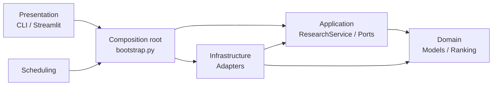
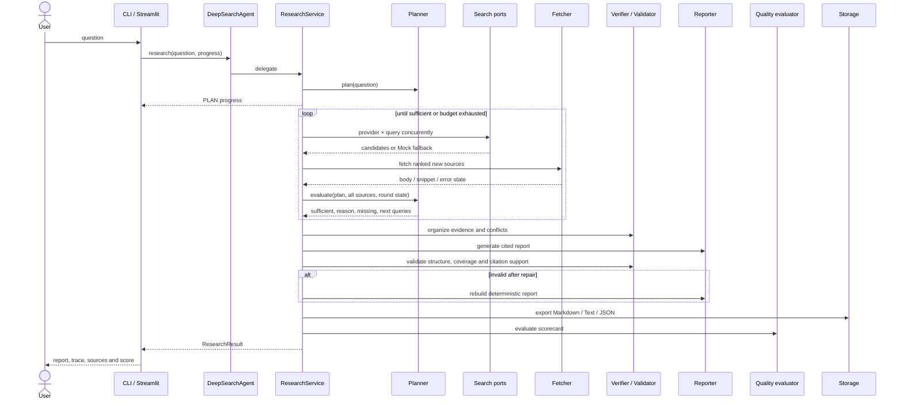

# DeepSearch 2.1 架构说明

> 状态：当前实现 · 最后校准：2026-08-28

## 1. 架构目标

DeepSearch 采用轻量 Clean Architecture，目标不是增加目录数量，而是把四类变化隔离：研究策略、外部网络、交付界面和本地运行配置。

- 研究规则不依赖 Streamlit、HTTP、文件系统或具体模型供应商；
- 搜索、抓取、缓存、模型和存储通过应用层端口注入；
- CLI、Web 和调度器消费同一个 `ResearchResult`；
- Mock 与真实实现走同一研究用例，测试不需要复制业务流程；
- 项目级路径以仓库根或配置文件目录为基准，不在包内生成第二套数据。

## 2. 源码依赖规则



这里区分两种方向：

1. **源码依赖方向**：基础设施实现 `application/ports.py` 的协议，因此 `infrastructure → application`；应用层不能导入具体基础设施。
2. **运行时调用方向**：`ResearchService` 通过协议调用注入对象，看起来像 `application → port implementation`，但应用层并不知道实现类名称。

允许的主要依赖如下：

| 调用方 | 可以依赖 | 不应依赖 |
|---|---|---|
| `domain` | 标准库 | application、infrastructure、Streamlit |
| `application` | domain、application ports | 具体搜索器、文件存储、Streamlit |
| `infrastructure` | domain、application ports | 页面脚本 |
| `presentation` | bootstrap、domain 展示模型 | 直接实例化搜索/缓存/存储实现 |
| `scheduling` | bootstrap facade、config | Streamlit 页面状态 |
| `bootstrap.py` | 所有需要装配的模块 | 页面布局逻辑 |

## 3. 当前目录与职责

```text
DeepSearch/
├── deepsearch/
│   ├── domain/
│   │   ├── models.py           # Brief、ReportSpec、Plan、Source、Trace、Scorecard、Result
│   │   └── ranking.py          # 相关性、来源质量和域名多样性
│   ├── application/
│   │   ├── service.py          # 研究主循环、追问复用、硬预算
│   │   ├── ports.py            # Planner/Search/Fetcher/Cache/Reporter/Storage 等协议
│   │   ├── planner.py          # 分类、拆解、充分性判断、查询调整
│   │   ├── verification.py     # 证据聚合、冲突提示、引用与覆盖校验
│   │   ├── evaluation.py       # 五维质量评分
│   │   └── prompts.py          # 集中管理模型提示模板
│   ├── infrastructure/
│   │   ├── search/
│   │   │   ├── base.py         # 搜索适配器公共边界
│   │   │   ├── duckduckgo.py   # DuckDuckGo HTML
│   │   │   ├── wikipedia.py    # MediaWiki API
│   │   │   └── mock.py         # 确定性离线来源
│   │   ├── config.py           # 默认值、JSON、环境变量、原子保存
│   │   ├── cache.py            # TTL 磁盘缓存
│   │   ├── fetcher.py          # 并发正文抓取与摘要降级
│   │   ├── llm.py              # OpenAI 兼容客户端与一次有界重试
│   │   ├── reporting.py        # LLM/确定性结论综合报告器
│   │   ├── storage.py          # Markdown/Text/JSON 导出、列表和搜索
│   │   └── customer_service.py # 知识库 HTTP 投递、认证、重试和路径型 outbox
│   ├── presentation/
│   │   ├── cli.py              # ask/interactive/history/topics/schedule/web
│   │   └── web/
│   │       ├── support.py      # Session State、配置、视图行转换
│   │       └── styles.py       # 集中加载品牌 CSS
│   ├── scheduling/topics.py    # 自主任务模型、每日/每周/单次幂等调度
│   ├── bootstrap.py            # 唯一组合根、DeepSearchAgent facade、三档模式
│   └── __main__.py             # python -m deepsearch
├── app_pages/                  # 五个直接执行的 Streamlit 页面脚本
├── assets/                     # CSS 与 SVG
├── .streamlit/                 # 主题、服务配置和 secrets 示例
├── tests/                      # 离线优先回归测试
├── docs/                       # 当前文档集
├── reports/                    # 唯一默认报告目录
└── streamlit_app.py            # st.navigation 多页面入口
```

`__pycache__`、`.cache/`、`logs/`、`config.json`、`.streamlit/secrets.toml` 和生成报告都是运行产物，不属于逻辑架构。

## 4. 组合根与公共入口

`bootstrap.py` 是唯一集中创建具体基础设施对象的位置：

```text
Settings
  ├─ ResearchPolicy
  ├─ DuckDuckGoSearch + WikipediaSearch 或 MockSearch
  ├─ WebFetcher + ResearchCache + SourceRanker
  ├─ ResearchPlanner + CrossVerifier + AnswerValidator
  ├─ MarkdownReporter(+ optional LLM)
  ├─ FileReportStorage
  └─ ResearchQualityEvaluator
                 ↓
           ResearchService
                 ↓
       DeepSearchAgent facade
```

`DeepSearchAgent` 只保留稳定 API：`research()` 和 `follow_up()`。它不拥有研究算法；主循环在 `application/service.py`。这样既兼容 CLI/调度器/外部脚本，又能独立注入 Fake 或 Mock 端口测试应用层。

## 5. 单次研究时序



## 6. 状态、预算与停止条件

`ResearchPolicy` 是单次研究的不可变预算：`max_rounds`、`results_per_query`、`max_sources` 和 `mock_search`。`ResearchBrief` 则描述领域、目标、信息类型、时间范围和 `ReportSpecification`。Web 模式和自主任务都把这些对象作为真实输入传入规划器与报告器，而不是只在界面展示。

| 模式 | 最大轮次 | 最大来源 | 每查询候选 | 用途 |
|---|---:|---:|---:|---|
| 快速 | 1 | 8 | 3 | 事实核查、快速浏览 |
| 均衡 | 配置值（默认 3） | 配置值（默认 16） | 配置值（默认 4） | 日常分析 |
| 深度 | 4 | 28 | 6 | 对比、技术选型、复杂调研 |

停止并非简单固定循环，按业务判断与硬预算共同决定：

1. 简单事实有可用来源即可停止；
2. 复杂问题在最低轮次前继续，以产生一次真实策略反馈；
3. 来源和子问题覆盖达到阈值时停止；
4. 连续两轮无新增来源时停止；
5. 达到最大来源或最大轮次时停止。

每轮产生 `RoundTrace`；整次研究产生 `ResearchMetrics` 和 `ResearchScorecard`。三者均进入 `ResearchResult`，展示层不再解析日志来推断状态。

## 7. 证据与质量边界

- `CrossVerifier` 以规范化文本主题聚合证据；同主题多源标为多源，数字集合不一致时提示口径冲突。
- `AnswerValidator` 检查引用编号、必要章节、子问题标题和详细论点与所引文本的词项重叠。
- 校验失败先做轻量引用修复；仍失败则使用确定性报告器重建。
- `ResearchQualityEvaluator` 给出五维风险画像，但不声称自动证明事实为真。

当前验证属于确定性、可测试的工程下限，不是 NLI/蕴含模型，也不会裁决统计口径、来源时效和作者身份。

## 8. 路径与运行数据

- `config.json` 默认从启动工作目录解析；Web 入口显式把默认路径固定到仓库根。
- `reports_dir` 和 `cache_dir` 的相对路径以 `config.json` 所在目录解析。
- `deepsearch web` 和 `streamlit_app.py` 使用同一个仓库根，报告不会写入 `deepsearch/presentation/`。
- secrets 只来自环境变量或 `.streamlit/secrets.toml`；`save_settings()` 始终把 `api_key` 写为空字符串。
- 配置和缓存都使用临时文件替换，降低中断造成半文件的风险。

## 9. Streamlit 展示架构

`streamlit_app.py` 使用 `st.navigation(position="top")` 注册 `app_pages/` 下五个页面。入口统一初始化跨页面 Session State；页面是直接脚本，只组合 UI，不包装成大型渲染函数。

- `messages`、`last_result`、`progress_events`、`research_profile` 属于每个会话；
- 研究通过 `st.status`/进度回调展示，结果以统一领域对象写入状态；
- 只有报告目录扫描等可重复数据加载使用有界 `st.cache_data`；
- 主题和配置通过 form 批量提交；API Key 不经过普通配置表单落盘；
- 视觉 token 主要在 `.streamlit/config.toml`，必要的品牌增强集中在 `assets/app.css`。

“研究”页允许配置领域、信息类型、时间窗口、文件格式、目标篇幅、读者、章节和自定义要求；“设置 → 自主任务”把同一组要求与每日/每周/单次周期组合。报告中心统一索引 `.md`、`.txt` 和 `.json`。

## 10. 自主任务架构

`ScheduledResearchTask` 同时保存调度规则、研究强度、`ResearchBrief`、是否投递 CustomerService 及数据密级。`ResearchTaskScheduler` 到期时创建对应强度的 Agent，重新执行完整研究循环；只有成功生成报告后才写入幂等状态。一个任务失败不会阻止同批次其他任务。

- `daily`：每天到点一次；
- `weekly`：在指定星期到点运行；
- `once`：指定日期时间，错过时间后首次检查仍会补跑；
- `schedule --once` 适合 Windows 任务计划程序或 cron；
- `schedule --poll` 是个人电脑上的前台轻量轮询器。

启用联动的任务在报告落盘后调用 `CustomerServicePublisher`。任务名生成稳定 `external_id`，内容哈希区分版本；网络错误、429 和 5xx 先做有界指数退避，仍失败则写入只含报告路径与哈希的 outbox。调度器后续轮询只重试投递，不重新执行研究。两类密钥只从环境变量或 Streamlit Secrets 读取，`save_settings()` 永不持久化它们。

## 11. 扩展方式

| 需求 | 实现位置 | 核心循环是否修改 |
|---|---|---|
| 新搜索源 | 实现 `SearchProvider`，在 `bootstrap.py` 注册 | 否 |
| 新正文读取器 | 实现 `SourceFetcher` | 否 |
| SQLite/S3/向量存储 | 实现 `ReportStorage` | 否 |
| HTML/PDF 输出 | 实现 `Reporter` | 否 |
| 新质量模型 | 实现 `QualityEvaluatorPort` | 否 |
| 领域化规划 | 实现/组合 `Planner` | 通常否 |
| 后台任务与事件流 | 在展示入口外增加 job adapter | 应保持 ResearchService 不感知 Web |

## 12. 有意保留的边界

项目当前是单机个人研究工具，不实现登录、多租户、数据库、分布式任务和浏览器自动化。下一阶段若生产化，应优先增加后台任务状态机、取消/恢复、claim-evidence graph、时效与蕴含校验，以及可重复的端到端评测集；不要把这些职责重新塞回 `ResearchService` 或页面脚本。
